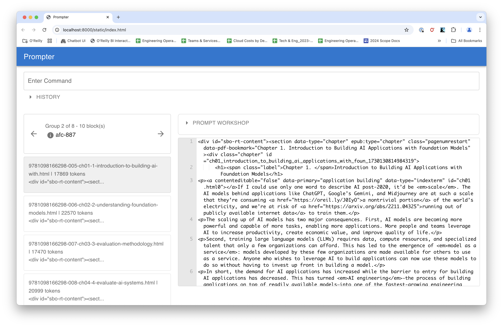

# Command Reference

## Core Features

### load

Load a file or files as a new group.

- **Arguments:**
  - `files` (required): List of files or URLs to load.
  - `--tag` (optional): Tag to use for the group.
- **Example:**

  ```
  load *.txt --tag=text_files

  load book.epub

  load http://example.com
  ```

### transform

Transform a block using specified transformations. If you chain multiple transformations together, they are applied in the order they are specified.

- **Arguments:**
  - `transformation` (required): Transformations to apply. Available transformations are:
    - `token-split`: Breaks text into overlapping chunks of 1000 tokens overlapping by 10%.
    - `clean-epub`: Simplifies the HTML of an EPUB.
    - `html-h1-split`: Breaks HTML into blocks based on H1 tags.
    - `html-h2-split`: Breaks HTML into blocks based on H1 and H2 tags.
    - `html-to-md`: Converts HTML to Markdown.
    - `html-to-txt`: Converts HTML to plain text.
    - `new-line-split`: Splits text into blocks based on new lines.
    - `sentence-split`: Splits text into blocks based on sentences.
    - `strip-attributes`: Remove all attributes from HTML tags.
    - `extract-headers`: Extract HTML headers (through h4)
    - `feed-to-abridged-json`: Converts an RSS feed to an abridged JSON format Use --n to specify the number characters to use from the summary.
  - `--tag` (optional): Tag to use for the group.
  - `--where` (optional): Where clause for the blocks.
  - `--n` (optional): Number of tokens to split (default: 1000).
  - `--overlap` (optional): Overlap percentage (as an integer) for token-split (default: 10).
- **Examples:**

  ```
  transform clean-epub --tag=cleaned --where="block_tag like 'ch%'"

  transform html-to-md token-split --n=1500
  ```

### complete

Complete a block using OpenAI.

- **Arguments:**
  - `task` (required): Filename or URL of the task template.
  - `--persona` (optional): Filename or URL of the persona template.
  - `--context` (optional): context file (default: DEFAULT_CONTEXT_FN).
  - `--tag` (optional): Tag to use for the group.
  - `--model` (optional): Model to use (default: OPENAI_DEFAULT_MODEL).
  - `--temperature` (optional): Temperature to use (default: OPENAI_DEFAULT_TEMPERATURE).
  - `--where` (optional): Where clause for the blocks.
- **Example:**
  ```
  complete summarize.jinja --tag=summary --model=gpt-4o --temperature=0.3
  ```

### run

Run a file containing of prompter commands. For example, the following file of commands would allow you to summarize an epub file:

```
set FN test.epub
load {{FN}}
select "block_tag like 'chapter%'"
transform clean-epub html-to-md token-split --n=1500
complete summarize-block.task
squash
complete cleanup-summary.task
retag summary-{{block_tag}}.md
write
```

- **Arguments:**
  - `fn` (required): File or URL to run.
- **Example:**
  ```
  run script.prompter
  ```

### browse

Opens a browser application so that you can view data, run commands, and experiement with different prompts.



## Data Management

### use

Specifiy the name of the SQLite database you want to use to store your data. This database will be created in the current working directory. If you change the working directory, prompter will create a new database in the new directory using the same name.

- **Arguments:**
  - `db_name` (required): Database name to use.
- **Example:**
  ```
  use summary.db
  ```

### blocks

List all blocks.

- **Arguments:**
  - `--where` (optional): Where clause for the blocks.
- **Example:**
  ```
  blocks --where="block_tag like 'ch%'"
  ```

### groups

List all groups.

- **Arguments:**
  - `--where` (optional): Where clause for the group.
- **Example:**
  ```
  groups --where="group_tag like 'my_group%'"
  ```

### checkout

Checkout a group.

- **Arguments:**
  - `tag` (required): Tag to checkout. This can be:
    - _tag_: the name of the group to checkout
    - `latest`: checkout the latest group
    - `first`: checkout the first group
    - `next`: checkout the next group
    - `previous`: checkout the previous group
- **Example:**
  ```
  checkout my_group
  ```

### squash

Squash the current group into a new group by tag. Use this to combine blocks into a single block.

- **Arguments:**
  - `--delimiter` (optional): Delimiter to use (default: "\n").
  - `--tag` (optional): Tag for the new group.
- **Example:**
  ```
  squash --delimiter="\n\n" --tag=squashed_group
  ```

## Generating Output

### write

Write the current group to a file.

- **Arguments:**
  - `--fn` (optional): Filename pattern (jinja2) to write to (default: "{{block_tag}}").
  - `--where` (optional): Where clause for the blocks.
- **Examples:**
  Write each block to a file named after its tag:
  ```
  write --fn="output/{{block_tag}}.txt"
  ```

### speak

Convert the current block to audio files.

- **Arguments:**
  - `--fn` (optional): Filename pattern (jinja2) to write to (default: "{{block_tag.split('.') | first}}-{{ '%04d' % position}}.mp3").
  - `--where` (optional): Where clause for the blocks.
  - `--voice` (optional): Voice to use (default: "alloy").
  - `--preview` (optional): Preview the filenames.
- **Example:**

  ```sh
  speak --fn="audio/{{block_tag}}.mp3" --voice=alloy
  ```

## Environment Management

Environment variables allow you to create symbols you can use in instructions, rather than literal strings. For example, you might use environment variables to set a source URL for the location of your task and persona prompts. When the script is run, the environment variables are replaced with their values. For example:

```
set SOURCE https://example.com
```

And then you can do something like this:

```
complete {{SOURCE}}/summarize.md --persona={{SOURCE}}/persona.md
```

You can pass environment variable into your scripts when they starts by creating a (bash) variable that begins with `PROMPTER\_`. (Note that the "PROMPTER\_" prefix will be stripped off.) For example, an environment variable created with `export PROMPTER_ENV=dev` automantically becomes available in the prompter environment as `ENV=dev`.

### set

Set an environment variable.

- **Arguments:**
  - `key` (required): Key to set.
  - `value` (required): Value to set.
- **Example:**
  ```
  set SOURCE https://example.com
  ```

### unset

Remove an environment variable.

- **Arguments:**
  - `key` (required): Key to remove.
- **Example:**
  ```
  unset SOURCE
  ```

## Other Commands

### version

Print the version of the application.

- **Example:**
  ```
  version
  ```

### exit

Exit the REPL (Read-Eval-Print Loop).

- **Example:**

  ```
  exit
  ```
