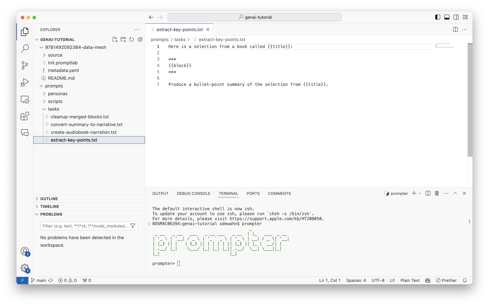

# Understanding Prompter

Prompter is a tool for applying Large Language Model (LLM) prompts to content at scale. It provides both a command-line REPL interface and a GUI for managing the workflow of:

1. Loading content from various sources
2. Processing that content into LLM-friendly chunks
3. Applying prompts systematically
4. Managing and storing the results

## Core Concepts

Before diving in, it's important to understand these key concepts:

### Blocks

A block is a chunk of text that can be processed by an LLM. Blocks are the fundamental unit in Prompter:

- They should ultimately fit within an LLM's context window (typically 8K tokens) via a series of transformations
- Can be in various formats (HTML, Markdown, plain text)
- Have metadata like IDs and tags for tracking

### Groups

Groups are collections of related blocks:

- Created when you load, transform, or combine blocks; thet are also created when you perform a completion ask with an LLM
- Have a unique tag for identification (auto-generated or user-specified)
- Only one group is "active" at a time (the current group)

Each group has a unique tag that can be used to identify it. You can supply a tag when you create a group, or Prompter will generate one for you. Use the `checkout <tag>` command to set the current group to a specific tag. (There are also reserved tag names `first`, `last`, `next` and `previous`).

Suppying your own tag can be useful if you want to refer to the group later. For example, you might tag a group with a name like `final` if it represents the final step in a series of transformations. You can then perform various operations like completions, but then use the `checkout final` command to go back to the `final` group.

### Completions

A completion is the result of applying a prompt template to a block and then sending it to an LLM.

### Tasks

A task is a prompt that is applied to a block. Tasks use [jinja](https://jinja.palletsprojects.com/en/3.0.x/) templating to create prompts that can be applied to blocks. For example, a task might ask the LLM to summarize a block of text or generate a list of key points.

```
Here is a selection of text from a book called {{title}} by {{authors}}. Please summarize it in 250 words or fewer:

{{content}}
```

#### Personas

If a task tells the LLM what to do, a persona tells it how to do it. Personas are a way to customize the behavior of the LLM by providing it with additional context. For example, you might have a persona that tells the LLM to write in the style of a particular author or to use a specific tone.

### Context variables

Context variables are key-value pairs that can be used in tasks and personas. They allow you to provide additional context to the LLM. For example, you might have context variables for the title and author of a book that you are summarizing.

You can save context variables in a YAML file that you can supply with the `--context` flag when you run a completion, or you can set them directly using the `set` command. For example:

```
set TITLE "The Great Gatsby"
set AUTHOR "F. Scott Fitzgerald"
```

Note that Prompter will automatically capitalize the keys of context variables, so you can use them in your templates like this:

```
Here is a selection of text from a book called {{TITLE}} by {{AUTHOR}}. Please summarize it in 250 words or fewer:

{{content}}
```

Finally, you can use environment variables set in the shell to provide context variables to Prompter by prefacing them with `PROMPTER_`. For example, you might set the `TITLE` and `AUTHOR` environment variables in your shell before running Prompter.

```
export PROMPTER_TITLE="The Great Gatsby"
export PROMPTER_AUTHOR="F. Scott Fitzgerald"
```

### Workflows

A typical Prompter workflow follows these steps:

1. **Load** content into the SQLite database
2. **Transform** content into LLM-friendly format (e.g., HTML → Markdown)
3. **Split** content into appropriate block sizes
4. **Apply** prompts (tasks + personas) to blocks
5. **Manage** the results as new blocks

Commands in prompter have a basic syntax that consists of a command name and a set of arguments that follow typical command line format. For example, completing a prompt looks like this:

```
complete extract-key-points.task --persona=oreilly-short.txt --context=metadata.yaml
```

You can find full documentation for prompter at https://github.com/odewahn/prompter.

The following sections assume you have followed the instructions above and downloaded some content and prompts into a root directory.

## Installation and setup

Download and install prompter from the [releases page](https://github.com/odewahn/prompter/releases).

Next, create a working direcory. For the purposes of this walkthrough, let's assume all files are in a directory called `genai-tutorial`:

```
cd ~
mkdir genai-tutorial
cd genai-tutorial
code .
```

Within VSCode, open a terminal and type `prompter`. Your environment should look something like this:



## Summarizing an Essay

Let's start with a simple example -- summarizing an essay. The main things to understand about using prompter are:
